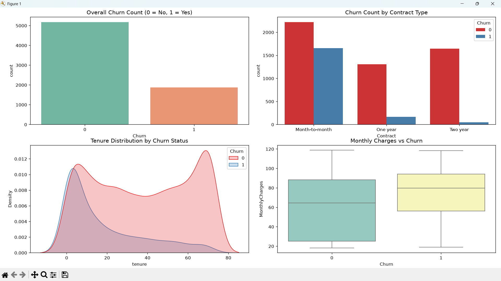
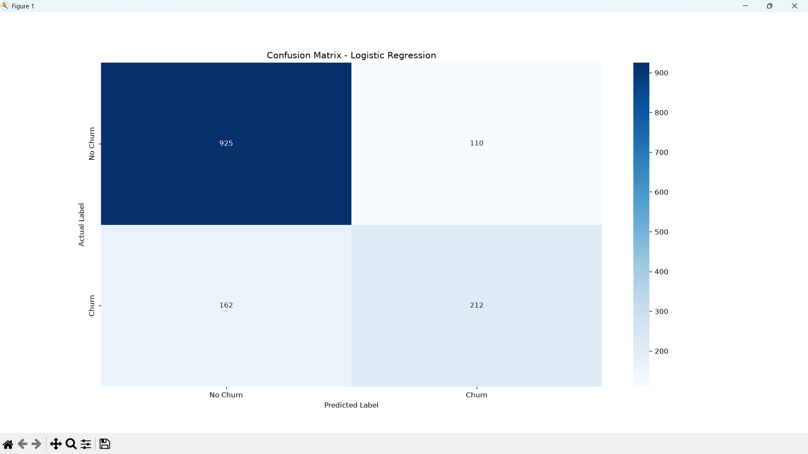

# Customer Churn Prediction 📊📉

An end-to-end Machine Learning and Data Analytics project designed to analyze telecom customer demographics, service usage, and contract types to accurately predict customer churn and identify key business risk factors.

---

## 🖼️ Exploratory Data Analysis & Model Evaluation

### 1. Exploratory Data Analysis (EDA Overview)


---

### 2. Confusion Matrix (Logistic Regression)


---

## 🚀 Overview

Customer churn prediction is crucial for subscription-based telecommunication providers to increase retention rates. This project uses historical customer data to train classification models (Logistic Regression, Random Forest, Gradient Boosting), perform Exploratory Data Analysis (EDA), and uncover insights into why customers leave.

### Key Highlights:
* **Exploratory Data Analysis (EDA):** Visualizations exploring correlations between tenure, monthly charges, contract types, and churn rates.
* **Predictive Modeling:** Machine Learning classification pipelines trained on Telco customer records.
* **Model Evaluation:** Evaluates precision, recall, F1-score, ROC-AUC, and confusion matrix.
* **Data Preprocessing:** Robust workflow handling missing values, encoding categorical variables, and standardizing features.

---

## 🛠️ Tech Stack & Libraries

* **Language:** Python 3.8+
* **Data Manipulation:** Pandas, NumPy
* **Machine Learning:** Scikit-learn
* **Data Visualization:** Matplotlib, Seaborn

---

## 📁 Project Structure

```text
Customer_Churn_Prediction/
│
├── customer_churn_prediction.py       # Main Python script for data processing, EDA & model training
├── WA_Fn-UseC_-Telco-Customer-Churn.csv # Telco Customer Churn Dataset
├── eda_churn_overview.png             # EDA Visualization Screenshot
├── confusion_matrix.png               # Model Confusion Matrix Screenshot
├── requirements.txt                   # Project dependencies
└── README.md                          # Project documentation
